# Spring2018
# Project 1: Some Simple SPOOKY Data Analysis

----

### [Project Description](doc/)
This is the first and only *individual* (as opposed to *team*) this semester. 

Term: Spring 2018

+ Project title: The Similarities and Differences among Spooky Authors
+ This project is conducted by Pak Kin Lai, pl2599
+ Project summary: This project's purpose is to use various techniques to study the similarities and the differences in writing among three horror story authors, Edgar Allan Poe, HP Lovecraft, and Mary Shelley. This project's analysis is split into 3 major sections: Sentence and Structure Analyses, Characteristic Word Analyses, Pair Analyses, and Sentiment Analyses.

Following [suggestions](http://nicercode.github.io/blog/2013-04-05-projects/) by [RICH FITZJOHN](http://nicercode.github.io/about/#Team) (@richfitz). This folder is organized as follows.

```
proj/
├── lib/
├── data/
├── doc/
├── figs/
└── output/
```

Please see each subfolder for a README file.

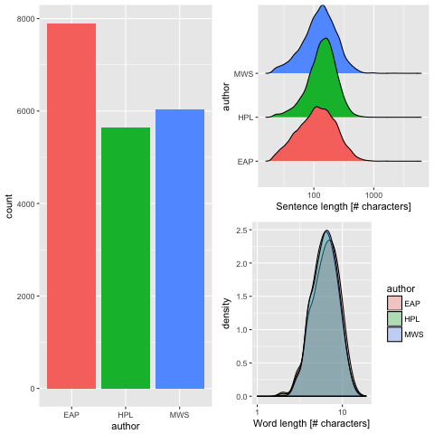
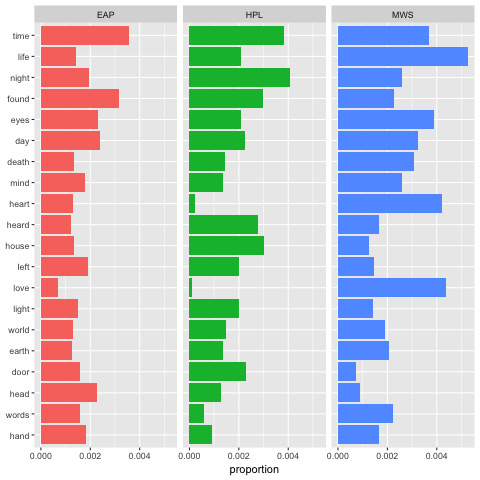
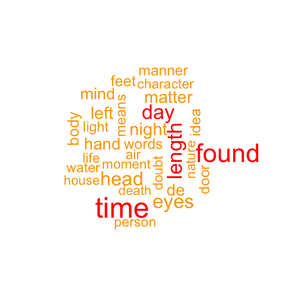
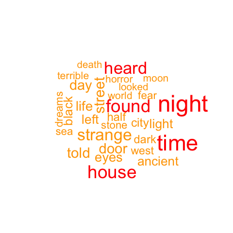
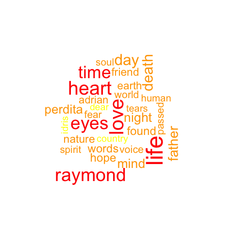

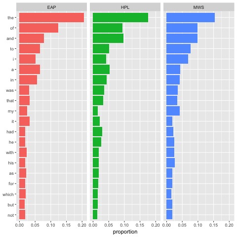
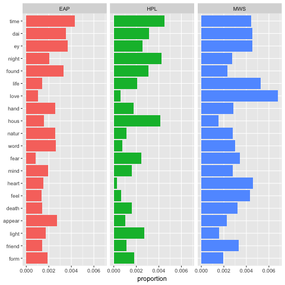
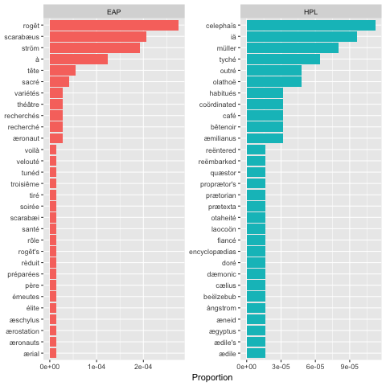
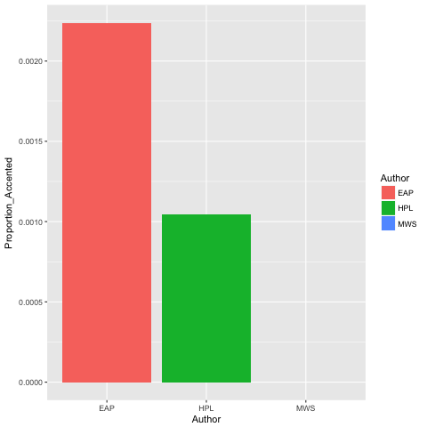
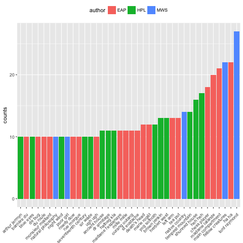
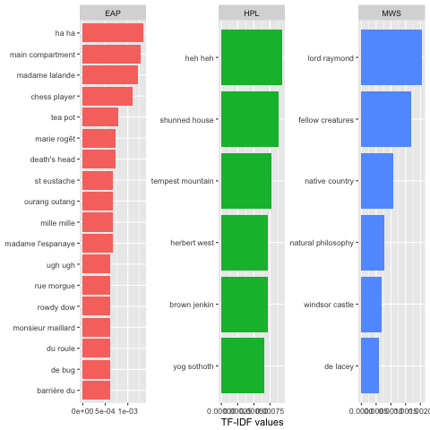
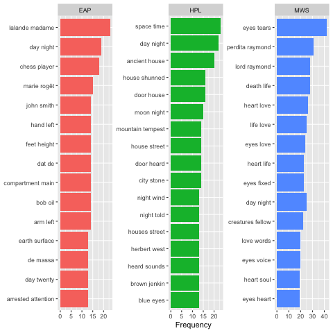
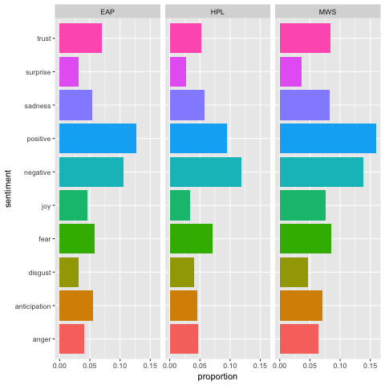
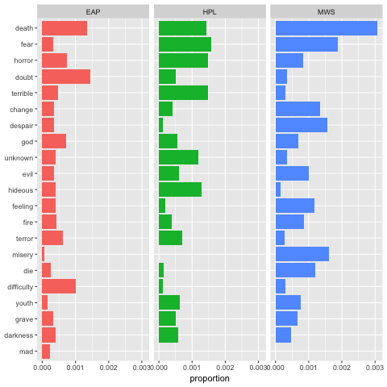

